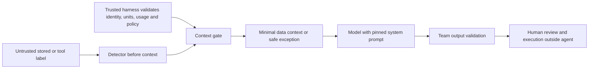

# Injection Risk Prevention - Build and Handoff

Status: all five approved phases completed locally on feature/injection-risk-prevention. This is Emmanuel's detector/context-handoff lane, not the full pharmacy application. No push or merge is included.

## PLANNER phase plan and outcomes

| Phase | Build process | Acceptance evidence | Status |
|---|---|---|---|
| 1 - Label contract | Add bounded types, Unicode checks and structured decisions | Valid accents pass; actual U+200B fails without stripping | Complete |
| 2 - Context gate | Exclude unsafe labels; separate optional descriptions from required evidence | Independent evidence can continue; uncertain required evidence stops | Complete |
| 3 - Pattern library | Add versioned signals with explanations, attacks and legitimate counterexamples | Fixed patterns and synthetic regression cases pass | Complete |
| 4 - Local evaluation | Run fixtures, report disagreement and evidence limits | 25/25 cases; counters are fixture-specific | Complete |
| 5 - Team handoff | Record integration contract, two security rounds and final review; update Mod status | 32 tests pass; review report and document comparison supplied | Complete |

PLANNER recommendations: keep policy defaults explicit prototype assumptions; preserve legitimate Unicode; build one observable behavior at a time; use deterministic findings rather than model guesses. Add new signals only with a named rationale, failing example, legitimate counterexample and regression test. Review before changing policy. Never let the model rewrite its own patterns or treat a pattern miss as trusted evidence.

## Project structure

- src/injection_prevention/contracts.py: decisions, references, safe findings and label policy.
- src/injection_prevention/label_detector.py: type/length/Unicode checks followed by bounded signals.
- src/injection_prevention/context_gate.py: safe context/exception and evidence-based continuation flags.
- src/injection_prevention/patterns.py: label-signals-v1, seven signals and counterexamples.
- src/injection_prevention/reporting.py: deterministic explanation, not model intent inference.
- src/injection_prevention/evaluate.py: trusted local fixture evaluator and safe failure state.
- tests/: behavior tests and fixtures/labels.json (synthetic only).
- docs/planning/INJECTION-PREVENTION-REVIEW.md: security evidence and exact change lines.
- docs/planning/INJECTION-PREVENTION-CHANGES.html: green additions/red deletions for this action's document edits.

## Architecture connection



Implemented here: detector, gate and deterministic exception/explanation. Stored/server-side data enters the same untrusted boundary. The team must enforce the pinned prompt, tool allowlist, numeric validation, output checks and stop conditions. Neither model nor tool data may set gate flags or impersonate a detector result. Injection can still enter in accepted labels, other fields, FDA text, user messages and supported media; those wider paths are not covered by this label component.

## Callable contract

Call detect_label with the original field value, trusted opaque item/field/source references, and a harness-owned required_evidence_affected boolean. Default label policy is 1-120 Unicode code points, at most 16 findings, letters/numbers/attached combining marks, ASCII spaces and punctuation .,-/()+%. These are prototype assumptions requiring representative catalog review, not pharmacy policy or clinical rules. Any format failure is REJECT; a known instruction signal without a format failure is FLAG; otherwise ACCEPT. ACCEPT means configured checks passed, not semantic trust or validated drug identity.

Unexpected controls, formatting/joiner characters, invisible exceptions and unsupported symbols are rejected under this single-line field contract. Emoji rejection is a format exception, not proof of attack. Decomposed accents normalize to NFC only after inspection; identifiers never undergo label normalization. Valid non-Latin text without disallowed characters can pass. Languages needing joiners require field-policy review before production rather than blanket universal Unicode rejection.

DetectionResult contains item_reference, field_reference, source, decision, required_evidence_affected, findings and accepted-only normalized_label. Findings contain safe reason/correction, optional zero-based code-point position, U+ notation and pattern ID. No rejected/flagged raw label is carried. References must be application-generated opaque ASCII IDs, never copied descriptions or patient identifiers. Constructors and Findings are internal trusted contracts, not untrusted JSON deserializers.

The trusted harness then calls gate_label(result, required_evidence_validated=...). That boolean must come from independent validation of required identity, units, quantities, usage, freshness and policy, never from a label/model assertion. Numeric validators and calculations are teammate work. Invalid caller contracts raise a safe ValueError; the integration must catch contract errors and map them to MANUAL_REVIEW without copying exception input or tracebacks into context.

| Detector/evidence state | Context and handoff |
|---|---|
| ACCEPT and required evidence valid | Include normalized display label as untrusted data; supported downstream review permitted |
| FLAG/REJECT optional label, required evidence independently valid | Exclude label; include safe exception; supported downstream review permitted |
| FLAG/REJECT affects required evidence | Exclude label; MANUAL_REVIEW; calculation/recommendation flags false |
| Required evidence unavailable or unverified, any decision | MANUAL_REVIEW; calculation/recommendation flags false; no substitute values |

GateResult exposes model_context, audit_event, calculations_permitted and recommendation_permitted. Flags authorize only continuation of independently supported downstream review, never an order/write or a specific replenishment quantity. Caller must honor them, preserve valid unaffected items, and must not merge the raw tool object back into model context. Audit events omit accepted and rejected label text; retain source, safe references, reasons and code points. This library produces events in memory; storage, access controls, retention and human evidence viewer are not implemented.

## Tool and action boundaries

This lane has no network, database, order, inventory-write, model-call or tool-dispatch implementation. The evaluator reads only a trusted local synthetic fixture file. Direct user requests, SQL-shaped strings and valid-shaped lies cannot grant permissions through this component. Proving forbidden tool attempts are denied requires integration tests against the team's actual dispatcher; no such result is claimed here.

Keep operational access read-only. Staff writes belong to a separately authenticated/authorized server service, with parameterized database queries and transactions when built. Server-side placement is a partial control; it does not make text trusted. No staff write endpoint or SQL schema is implemented in this lane. FDA context must retain the PRD label External supporting context - national shortage signal and never override local days of supply or thresholds. Live FDA integration is not part of these tests.

## Local test process

From the repository root, using the verified Windows Python 3.13 launcher:

```powershell
py -3.13 -m unittest discover -s tests -v
py -3.13 -m src.injection_prevention.evaluate
```

No third-party dependencies are required. The evaluator prints safe JSON without input labels, returns 0 for complete expected agreement, 1 for mismatches and 2/INVALID_FIXTURE/MANUAL_REVIEW for invalid or unavailable fixture input. The --fixtures option is for trusted local synthetic test files only, not an upload endpoint.

Expected outcomes are defined before execution. Add a synthetic fixture that reproduces a new failure, compare benign labels and equivalent Unicode representations, then add a narrowly justified signal and rerun the full suite. Review signal version/rationale and gate behavior before committing. Passing fixtures measure agreement on this selected sample; they do not establish a universal detection rate. Deterministic explanations support review; no model is trained and no hidden reasoning is collected.

## Verification and limits

32 test methods pass, including the 25-case fixture set (9 benign, 16 expected exceptions), required/optional handoff matrix, nontext rejection, bounded findings, safe logs and every Cf character in this runtime's Unicode database. Two sequential security rounds and final read-only review are recorded separately. All examples and metrics are synthetic. A keyword-free factual lie deliberately passes label acceptance but cannot bypass a false trusted-evidence flag.

Not tested: live CVS data, live FDA API, production harness/model, identity/catalog validation, database grants/SQL queries, authentication, staff-write service, output factual enforcement, TLS, deployment, real alerts or overall pharmaceutical safety. No malicious intent is inferred from format exceptions. The first integration task for teammates is connecting the detector and gate before context assembly and testing denial at the real dispatcher. This is a future team dependency, not unfinished detector implementation.

Original draft, POLICY.md, prior proposals, architecture images, reusable skills and preexisting Mod edits are preserved. Existing HTML comparison remains historical; the new comparison covers only this build's document changes. Commits are local and individually staged; no push, PR or merge occurred.
