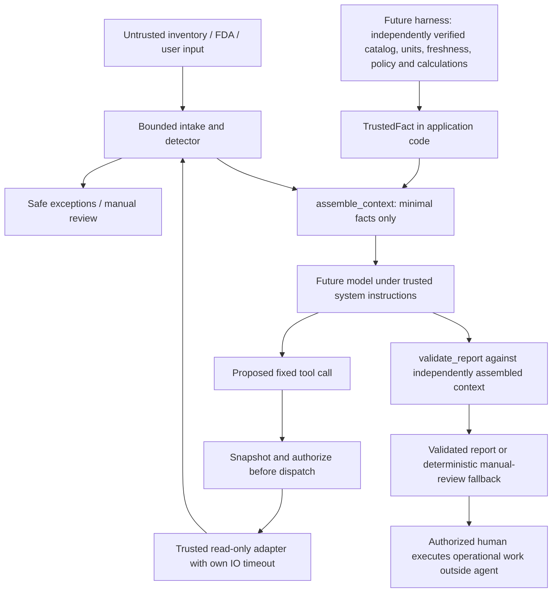

# Phase 6 Integration Handoff

Phase 6completes the approved standalone prevention lane after historical Phases 1–5. No Pharmacy push/merge or external AGENTS change. Read [plan](PHASE-6-PLAN.md), [security](PHASE-6-SECURITY.md) and [review/changed lines](PHASE-6-REVIEW.md). Original draft/POLICY and prior unrelated Mod edits/skills stay preserved.

## Ownership and process

| Member | Part | Verified contribution/status |
|---|---|---|
| Emmanuel De Jesus | Injection Risk Prevention | Standalone detection, context/action/output guards, synthetic local tester and qualification implemented in Phase 6 |
| Brahim Maouloud | Agent Instructions and Tooling | Assigned part; implementation status not established by this build |
| Kerrian Gordan | Harness | Assigned part; implementation status not established by this build |

| Sub-phase | Delivered |
|---|---|
| 6.1 | Bounded JSON/source contracts and 14-family matrix |
| 6.2 | label-signals-v2:15 signals with rationale, attack example and benign counterexample |
| 6.3 | Minimal context; all external descriptions excluded; required uncertainty/manual review |
| 6.4 | Snapshot-based fixed read dispatch, run limits and exact structured-output guard |
| 6.5 | Actual local Python visual tester and independent detection/containment counts |
| 6.6 | Regression, two SECURITY rounds/remediation, final review, documentation and clean imports |

## Integration diagram



Prompt injection can enter every external field or prior external record. Detector signals can miss unfamiliar meaning; the assembler still omits all free text. Fixed action permissions and report checks execute outside the model. There is no implemented full model loop: the future harness must use one shared trusted RunBudget per run, stop on exhaustion/error/unknown evidence or validated handoff, and never feed raw text back in a later turn. No autonomous action is added.

## Contracts and trust

| Interface | Caller contract and returned behavior |
|---|---|
| strict_json_loads(bytes) | UTF-8 <=64 KiB, no duplicate keys/nonfinite numbers, bounded JSON shape |
| inspect_payload(payload, source=Source...) | Source-specific shapes; static safe findings, decision/source provenance; no raw/decoded text |
| assemble_context(..., facts=tuple) | Exact TrustedFact objects constructed in trusted code; never deserialize submitted verified flags |
| execute_guarded(call, executors, budget, allowed_package_ndcs) | Caller-owned fixed callbacks; same captured call authorized/dispatched; only store 1618/NDC scoped reads |
| expected_report(context) / validate_report(proposed,context) | Context must come directly from trusted assembly; exact facts/classes/warnings/action claims; deterministic fallback on mismatch |

Inventory source profile minimally binds store 1618/synthetic flag/items/opaque IDs, known field names and supported text/policy shapes. It is not full medication, quantity, usage, date, policy or source-authenticity validation. Those are independently checked by the team's harness before constructing a fact. FDA rows support the PRD 11 fields, with package_ndc string/list; metadata remains bounded and omitted. Request shape is exactly request:text. Previous payloads must use the same source profile; combined fields/turns share bounds and remain untrusted.

Default limits: depth 6,2048 nodes,20 rows,1000 characters per generic value,4096 total value-text characters, label 1–120. Record/value text is bounded; identifiers retain exact representation. NDCs require configured segmented ASCII 4-4-2/5-3-2/5-4-1, not guessed conversion. Evidence refs are controlled opaque ASCII IDs, not descriptions or patients. TrustedFact verifies type/range only, not actual pharmacy truth. Approved thresholds / 14-day usage/freshness are future harness policy work; this package never calculates them.

Required item/store/NDC binding failure yields null affected quantity/duration, UNKNOWN, IDENTITY_UNVERIFIED and manual review; unaffected verified rows survive. Missing verified evidence yields no confident duration/class/recommendation. An unsafe optional label is omitted with a safe exception; supported facts remain available. FDA failure cannot replace or change local facts. All FDA enrichment stays synthetic UNVERIFIED/UNAVAILABLE here; live matching/pagination/freshness is unbuilt.

Generic text uses an explicit synthetic no-hidden-format/filler contract while permitting visible script letters/accents and ordinary note line breaks. Legitimate language text requiring joiners needs reviewed field policy before production; this is not a universal Unicode ban. Human inspection replaces invisible characters with U+names and is never model context. Human evidence is synthetic/local and not persisted in ordinary logs.

## Clean import example

Put this repository's src on PYTHONPATH in the team's environment; import the package independently of its tester:

```python
from injection_prevention import Source, TrustedFact, assemble_context
from injection_prevention import expected_report, validate_report

# Synthetic example ONLY. Real harness verifies all required evidence first.
facts = (TrustedFact('item-A', '0001-0123-01', 80, 'tablet',
                     6.22, 'ABOVE_THRESHOLD', 'synthetic-snapshot-A', True),)
raw = {'store_id': 1618, 'synthetic': True,
       'items': [{'item_id': 'item-A', 'product_label': 'Medication A'}]}
context = assemble_context(raw, source=Source.INVENTORY, facts=facts)
proposal = expected_report(context)  # Replace with future structured model output.
result = validate_report(proposal, context=context)
# Display result.report; a false accepted flag is manual-review fallback.
```

Do not let tool/model/user JSON construct facts, set verification, select executors, alter expected context or extend the allowlist. Catch ContractError/invalid caller configuration and map to a static MANUAL_REVIEW; never expose raw diagnostics. Security-facing report-v1 is intentionally a fixed subset of the future PRD report. Adding verified fields or model prose requires scoped output contracts/evals; do not relax equality to accept arbitrary explanations.

Tool allowlist: read_store_inventory(store_id=1618), get_fda_shortage_context(package_ndc in trusted tuple). No URL/SQL/shell/write/order/secret/disclosure tool. These are synthetic callback contracts, not live API implementations. Actual staff writes require a separate authenticated/authorized server service and credentials; parameterized SQL protects query boundaries, not prompt interpretation. No such database/write service is built here.

RunBudget defaults 100 attempts / 120 seconds; locked admission counters distinguish attempted/denied/dispatched/completed reads. Expiration is checked at entry/return, but cannot kill an arbitrary blocking callback. Real adapters need independent IO timeouts, bounded retries and reconciliation before any authorized side effect. Model integration must share one budget, honor MANUAL_REVIEW, and preserve supported unaffected facts.

## Local process and visible lens

```powershell
py -3.13 -m unittest discover -s tests -q
py -3.13 -m src.injection_prevention.qualification
py -3.13 -m src.injection_prevention.local_tester --port 8765
```

Open http://127.0.0.1:8765. Python 3.13 standard library only; no model or external API. Fixtures expose fixed synthetic 80 tablets / 6.22 days/ABOVE_THRESHOLD, not a quantity calculation. Missing evidence switches a predefined server fixture, not real verification. Unsupported tool choices never reach simulated executors. Character evidence uses safe textContent; no HTML/script interpretation. Raw JSON duplicates reach the server parser unchanged. Edited input invalidates prior/in-flight results. Server unavailable/malformed/rate-limited states never become successful tests.

## Risk-to-test coverage

| Family | Behavioral evidence |
|---|---|
| Hidden/control | Actual U+200B, all runtime Cf characters, bidi/control/filler combinations and recovery |
| Legitimate Unicode | Composed/decomposed accents, Japanese/Arabic/Korean/Khmer and benign punctuation |
| Paraphrase | Suppression/report-redirection cases and demonstrated prior misses |
| Fake authority | Claimed pharmacist approval, role tokens and forged policy permission |
| Obfuscation | Spaces, selected typos/lookalikes, base64/hex; decoded content never forwarded |
| Multilingual | Selected Spanish/French/German/Chinese attacks plus benign scripts; no language-wide claim |
| Other sources | Inventory/FDA/request shape checks, stored notes/metadata and source failure |
| Split/persistent | Combined fields and simulated prior turns scanned within total budget |
| Forged trust/reinsertion | Dict facts/flags/nesting rejected; all external text excluded even ACCEPT/missed meaning |
| Actions/disclosure | Denied order/write/SQL/shell/secret/outbound tools; snapshot mutation; scoped store/NDC reads |
| Output | Changed quantity/days/class/unit/identity, removed warnings, narrative injection and false claims |
| Bounds/failures | JSON/depth/text/node/row caps, missing evidence, deadline/budget/adapter failure, malformed fixtures/targets |
| Media | Image/OCR/audio-shaped/nontext input rejected; no media interpretation claimed |
| Rendering | Text-only display, headers/CSP, no arbitrary links; browser stale-result and delayed-response verification |

## Pattern building and qualification

1. Record the observed boundary/failure and expected outcome before changing signals.
2. Add a labelled synthetic reproduction and benign counterexample; a real missed instruction is a detection failure, not a pass because containment worked.
3. Add a bounded signal with stable ID/rationale; comparison normalization does not change original identifiers. Version the set when semantics change.
4. Run full regression and independently verify omission, trusted evidence, action denial and output enforcement, not just classification.
5. Review cases and source boundaries; retain known blind spots and never infer malicious intent from a format exception.

This supports inspectable reasons and repeatable review; it does not train a model, collect chain-of-thought or promise semantic understanding. label-signals-v2 has15 signals. Qualification has85 fixtures with overlapping examples, not85 unique attacks:55 unsafe detected,30 benign accepted,0selected misses/false positives;85 external-text exclusions.66behavior methods pass. A valid-shaped reassurance may ACCEPT; it stays omitted and cannot supply trusted facts.

Two sequential SECURITY rounds resolved two MAJOR/five MINOR findings, including argument mutation and required-result withholding. Clean-process package import passed without importing local_tester. Final read-only review records exact changed lines separately.

Untested: real harness/model/provenance, actual FDA/CVS adapters, database permissions/parameterized queries, staff authentication/writes, deployment/TLS, secrets inventory and supported media understanding. These are future integration checks, not passed controls. Original architecture PNGs remain historical design references; the diagram above identifies the implemented prevention boundaries and unbuilt harness/model responsibilities.

UX reference: [Laws of UX](https://lawsofux.com/) informed grouped stages, proximity, limited choices and visible feedback. Labels/focus/status text remain usable without color-only cues. Desktop 1280/mobile 390 layouts verified without page overflow.
